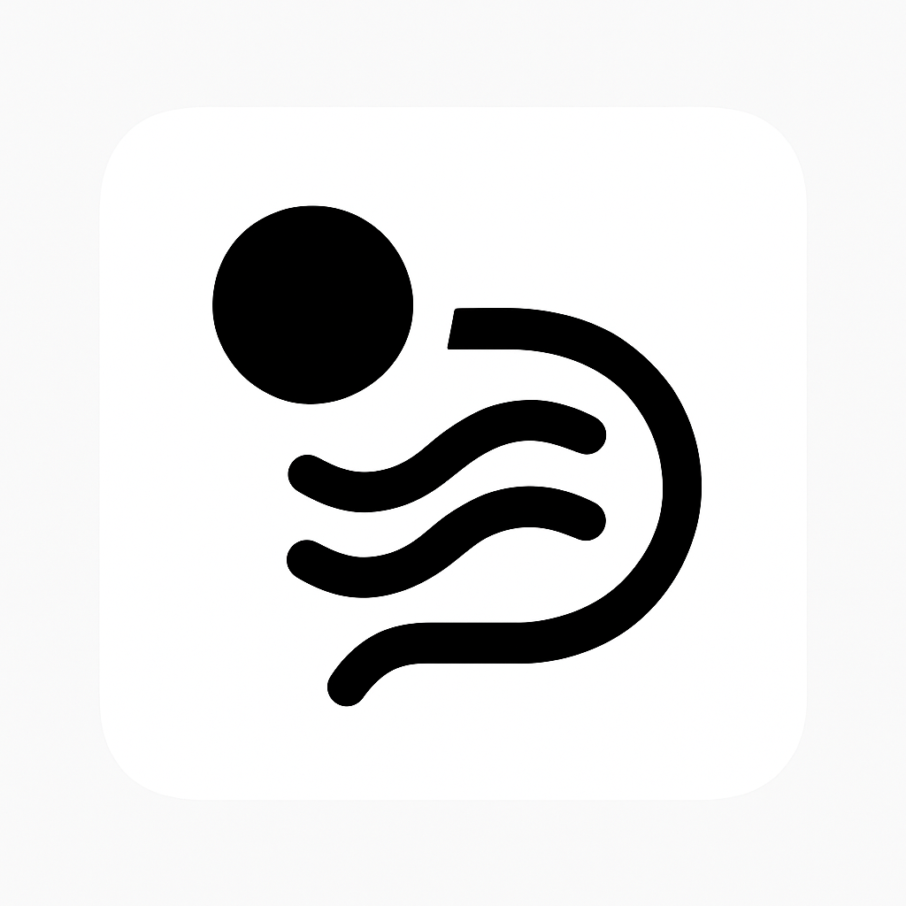

<div align="center">
  
  <h1 align="center">Aeru: Enhanced Apple Intelligence</h1>
</div>

[](https://opensource.org/licenses/Apache-2.0)
[](https://www.apple.com/ios/)
[](https://swift.org/)
[](https://developer.apple.com/xcode/)

> **An intelligent iOS application that combines Retrieval-Augmented Generation (RAG) and Web Search functions to provide contextually aware AI responses.**

Aeru is a powerful iOS app that leverages Apple's FoundationModels framework to deliver intelligent responses by searching both local knowledge bases and real-time web content. Built with SwiftUI and optimized for iOS, it provides a seamless chat interface for enhanced AI interactions.

### 👨🏽‍💻 [Demo Video](https://youtube.com/shorts/IuYqGmmnz94)

### 📱 [App Store Download](https://apps.apple.com/us/app/aeru-offline-private-ai/id6749188495)
- Must use an [Apple Intelligence activated device](https://9to5mac.com/every-device-that-supports-apple-intelligence/)
- Latest version of iOS 26

### 💬 [Discord Community](https://discord.gg/RbWjUukHVV)

## ✨ Features

### 🧠 **Dual Intelligence Sources**

- **RAG System**: Search through local vector databases for relevant context
- **Web Search**: Real-time web scraping via DuckDuckGo for up-to-date information
  
### 🚀 **Advanced AI Capabilities**

- **Apple FoundationModels**: Native integration with Apple's language models
- **Vector Embeddings**: Semantic search using NaturalLanguage framework
- **Streaming Responses**: Real-time response generation with live updates
- **Context Awareness**: Maintains conversation history for coherent interactions

### 💻 **Native iOS Experience**

- **SwiftUI Interface**: Modern, responsive design optimized for iOS with Liquid Glass effects
- **Chat Sidebar**: Organized conversation management
- **Keyboard Shortcuts**: Efficient navigation and interaction
- **Document Processing**: Support for various file formats in the knowledge base
- **Voice Mode**: Hands-free interaction with AI using natural speech

### 🔧 **Technical Excellence**

- **Vector Database**: SVDB integration for efficient similarity search
- **Web Scraping**: SwiftSoup for clean content extraction
- **Rate Limiting**: Respectful web scraping with built-in delays
- **Error Handling**: Robust error management and graceful degradation

## 🛠 Installation

### Prerequisites
- **iPhone 15 Pro or higher end model REQUIRED**
- **iOS 26.0 DEV 5/PUBLIC BETA 2 REQUIRED+**
- **Xcode 16.0+**
- **Swift 6+**

### Setup Instructions

1. **Clone the Repository**

   ```bash
   git clone https://github.com/yourusername/aeru.git
   cd aeru
   ```

2. **Open in Xcode**

   ```bash
   open ../Aeru.xcodeproj
   ```

3. **Install Dependencies**
   Dependencies are automatically managed through Xcode's built-in Swift Package Manager integration. The following packages will be resolved automatically:

   - **SVDB**: Vector database operations
   - **SwiftSoup**: HTML parsing and content extraction
   - **FoundationModels**: Apple's language model framework
   - **NaturalLanguage**: Text embeddings and processing
   - **Accelerate**: High-performance vector operations

4. **Build and Run**
   - Press `Cmd+R` or click the play button in Xcode
   - The app will launch with the main chat interface

## 🚦 Usage

### Basic Chat Interface

1. **Start a Conversation**: Type your question in the input field or use voice mode
2. **Choose Search Mode**:
   - Use RAG for queries about your local knowledge base
   - Use web search for current events and real-time information
3. **View Responses**: Watch as responses stream in real-time
4. **Manage Conversations**: Use the sidebar to organize multiple chat sessions

### Voice Mode

- **Hands-free Operation**: Activate voice mode for natural speech interaction
- **Real-time Processing**: Speech-to-text conversion with immediate AI response
- **Accessibility**: Enhanced accessibility for users who prefer voice interaction
- **Liquid Glass Interface**: Beautiful visual feedback with iOS 26's Liquid Glass effects

### RAG (Local Knowledge Base)

- **Add Documents**: Process documents into the vector database
- **Semantic Search**: Find relevant content using natural language queries
- **Context Integration**: Retrieved content enhances AI responses

### Web Search

- **Real-time Results**: Get current information from the web
- **Smart Scraping**: Clean content extraction from top search results
- **Source Attribution**: Responses include source information

## 🏗 Architecture

### Core Components

```
┌─────────────────┐    ┌─────────────────┐    ┌─────────────────┐
│  AeruView.swift │    │    LLM.swift    │    │  RAGModel.swift │
│   (UI Layer)    │◄──►│ (Orchestrator)  │◄──►│ (Vector DB)     │
└─────────────────┘    └─────────────────┘    └─────────────────┘
                              │
                              ▼
                       ┌─────────────────┐
                       │WebSearchService │
                       │ (Web Scraping)  │
                       └─────────────────┘
```

### Data Flow

1. **User Input** → AeruView captures user queries
2. **Query Processing** → LLM class determines search strategy
3. **Context Retrieval** → RAGModel searches vector database OR WebSearchService scrapes web
4. **AI Generation** → FoundationModels generates contextual responses
5. **UI Updates** → Streaming responses update the interface in real-time

### Key Technologies

- **SwiftUI**: Reactive UI framework
- **Combine**: Reactive programming for data flow
- **FoundationModels**: Apple's ML framework
- **Vector Embeddings**: NaturalLanguage + Accelerate
- **Web Scraping**: URLSession + SwiftSoup

## 🤝 Contributing

We welcome contributions! Here's how you can help:

### Development Setup

1. Fork the repository
2. Create a feature branch: `git checkout -b feature/amazing-feature`
3. Make your changes and test thoroughly
4. Commit with clear messages: `git commit -m 'Add amazing feature'`
5. Push to your branch: `git push origin feature/amazing-feature`
6. Open a Pull Request

### Code Standards

- Follow Swift API Design Guidelines
- Use SwiftUI best practices
- Include unit tests for new functionality
- Maintain documentation for public APIs
- Ensure Xcode builds without warnings

### Areas for Contribution

- 🐛 **Bug Fixes**: Help improve stability
- ✨ **Features**: Add new capabilities
- 📚 **Documentation**: Improve guides and examples
- 🧪 **Testing**: Expand test coverage
- 🎨 **UI/UX**: Enhance user experience

### Wishlist Updates

- 🤖 **MCP Server Support**: Create curated list of MCP Servers to connect and use on-device

## 📄 License

This project is licensed under the Apache License 2.0 - see the [LICENSE](LICENSE) file for details.

## 🙏 Acknowledgments

- **Apple**: For FoundationModels and NaturalLanguage frameworks
- **SVDB**: Vector database library
- **SwiftSoup**: HTML parsing capabilities
- **Open Source Community**: For inspiration and support

---

<div align="center">
  <strong>Built with ❤️ for the iOS community</strong>
</div>
